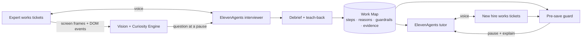

# Shadow

[](https://github.com/TanbirRamim/elevenlabs-agent/actions/workflows/ci.yml)

**The AI apprentice for support escalations.** Shadow sits beside a senior support lead while they triage tickets, asks *why* at natural pauses, turns their judgment into an evidence-linked Work Map, and coaches new agents to decide the same way, pausing a wrong refund before it is saved.

Built for the Hack-Nation × ElevenLabs 7th Global AI Hackathon, Challenge 01 "The AI Apprentice" ([brief](docs/challenge-brief.pdf)).

## The problem

The judgment that makes a senior support lead good is rarely written down: which refunds are fraud, when a ticket belongs to Legal, when to stop and ask. New hires learn it slowly, by watching or by making costly mistakes. Screen recordings show *what* happened, never *why*.

## How Shadow works

| 1 · Capture | 2 · Map | 3 · Teach |
| --- | --- | --- |
| The expert works real tickets in a helpdesk. An ElevenLabs voice agent watches the screen and asks short questions only at natural pauses, about what just happened on screen. | A spoken debrief closes the remaining gaps, including cases the expert never showed, and ends with a teach-back the expert confirms. Every step and guardrail links to its screen moment and the expert's own words. | A voice tutor watches a new hire work unseen tickets, asks them to predict decisions, and pauses any save that would break a guardrail, explaining it with the expert's reasoning and screen moment. |



## Design highlights

- **When to speak is deterministic; what to say is generated.** A pure, tested Turn Gate opens only after silence, no typing, a still screen, a valuable open gap and within a question budget.
- **Questions target gaps.** Every decision opens slots (reason, guardrail, exception); gaps are ranked by value and surprise, and anything the screen already shows is never asked.
- **Evidence or it doesn't exist.** A deterministic verifier checks that every quote in the Work Map is verbatim from the transcript and every screen moment exists. Unverifiable content becomes an open question, never a rule.
- **Guardrails are enforced before the save.** Literal rules run instantly; an LLM judge, limited to the expert's existing guardrails, covers new wording.
- **Privacy by default.** Off the record by voice, hotkey or button, with nothing stored for that span. Personal data is redacted with Microsoft Presidio before storage and before any model sees it.

## Stack

| Layer | Technology |
| --- | --- |
| Voice | ElevenAgents (interviewer and tutor), Scribe v2 Realtime, Expressive Mode, client tools, knowledge base |
| Reasoning | Claude (`claude-opus-5-5`) with schema-validated structured outputs, per-route effort |
| Web | Next.js 16, React 19, Tailwind CSS |
| API | Fastify 5 with WebSockets, Zod contracts shared end to end |
| Privacy | Microsoft Presidio (text and image redaction) |
| Hosting | Cloudflare Workers (web via OpenNext, API front door), Cloudflare Containers (API, Presidio), R2 storage |
| Quality | TypeScript strict, Vitest, Playwright, Biome, GitHub Actions with a guardrail eval on every PR |

## Run it locally

```bash
nvm use && corepack enable
pnpm install
cp .env.example .env      # ElevenLabs + Anthropic keys
pnpm infra:up             # Postgres, MinIO, Presidio
pnpm dev                  # web on :3000, API on :4000
pnpm verify               # lint, typecheck, tests
pnpm eval:guard           # guardrail catch-rate eval on the seed tickets
```

## Repository

```
apps/web          Next.js app: capture, Work Map, tutor, DeskSim helpdesk
apps/api          Fastify API: vision pipeline, Curiosity Engine, Work Map builder, guard
apps/edge         Cloudflare Worker + Containers config for the API and Presidio
packages/schema   Zod contracts shared by web and API
packages/guard    Deterministic guardrail engine + eval
packages/prompts  Versioned LLM prompts
agents/           ElevenAgents prompts and settings
seed/             Demo tickets (fake data)
docs/             Product plan, implementation plan, tasks, ADRs
```

## Docs

- [Product plan](docs/PRODUCT_PLAN.md): the problem, market fit and scope
- [Implementation plan](docs/IMPLEMENTATION_PLAN.md): architecture, component specs, timeline
- [Demo walkthrough](docs/demo-script.md)
- [Deploying to Cloudflare](docs/DEPLOY_CLOUDFLARE.md)
- [Contributing](CONTRIBUTING.md) · [Rules for AI coding assistants](AGENTS.md)

## Team

- **Tanbir Ramim** ([@TanbirRamim](https://github.com/TanbirRamim)): voice agents, capture, Work Map and tutor experience
- **Harshit**: helpdesk sandbox, API and reasoning pipeline
