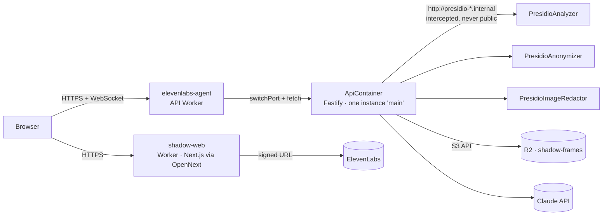

# Deploying Shadow to Cloudflare

Everything runs on Cloudflare: the web app as a Worker, the API and Presidio as Containers, and frames, recordings and session snapshots in R2.



| Piece | Where it lives | Config |
| --- | --- | --- |
| Web | `shadow-web` Worker (OpenNext adapter) | `apps/web/wrangler.jsonc`, `apps/web/open-next.config.ts` |
| API | `elevenlabs-agent` Worker + `ApiContainer` (built from `apps/api/Dockerfile`) | `apps/edge/wrangler.jsonc`, `apps/edge/src/index.ts` |
| Presidio | Three private containers from Microsoft's official images | `apps/edge/containers/*/Dockerfile` |
| Storage | R2 bucket `shadow-frames` via the S3 API | `S3_*` vars and secrets |

## Requirements

- Cloudflare account on the **Workers Paid plan** (US$5/month; required for Containers). Containers are billed only while running and sleep after 2 h idle (`sleepAfter`); see [Containers pricing](https://developers.cloudflare.com/containers/pricing/).
- Docker running locally (wrangler builds and pushes the container images).
- `pnpm install` done; `pnpm exec wrangler login` once.

## Deploy from the Cloudflare dashboard (Git integration)

Both Workers can build and deploy from GitHub on every push to `main` (Workers Builds also builds the container images). Account: **Tanbirramim420@gmail.com's Account** (`d7adc56ae0b48c02f351bb3e7ca6b9bc`, pinned in both `wrangler.jsonc` files).

**One-time:** R2 → enable R2 → create bucket `shadow-frames` → Manage API tokens → create an *Object Read & Write* token scoped to `shadow-frames` (gives the access key id and secret).

### API Worker (deploy first)

Workers & Pages → Create → Import a repository → `TanbirRamim/elevenlabs-agent`

| Setting | Value |
| --- | --- |
| Worker name | `elevenlabs-agent` (must match `apps/edge/wrangler.jsonc`) |
| Production branch | `main` |
| Root directory | *(leave empty: repo root)* |
| Build command | *(leave empty; the deploy command builds what it needs)* |
| Deploy command | `pnpm --filter @shadow/edge exec wrangler deploy` |
| Non-production branch deploy command | `pnpm --filter @shadow/edge exec wrangler versions upload` |
| Build variables | `NODE_VERSION` = `22` · `PNPM_VERSION` = `12.4.1` |

The first deploy succeeds without secrets and creates the Worker. Then: Settings → Variables and Secrets → add as **Secret**: `ANTHROPIC_API_KEY`, `S3_ACCESS_KEY`, `S3_SECRET_KEY` (saving a secret redeploys the Worker; the API container picks them up on its next start). The API URL is `https://elevenlabs-agent.<your-subdomain>.workers.dev`.

### Web Worker

Workers & Pages → Create → Import a repository → same repo

| Setting | Value |
| --- | --- |
| Worker name | `shadow-web` (must match `apps/web/wrangler.jsonc`) |
| Production branch | `main` |
| Root directory | *(leave empty: repo root)* |
| Build command | `pnpm cf:build:web` |
| Deploy command | `pnpm --filter @shadow/web exec opennextjs-cloudflare deploy` |
| Non-production branch deploy command | `pnpm --filter @shadow/web exec opennextjs-cloudflare upload` |
| Build variables | `NODE_VERSION` = `22` · `PNPM_VERSION` = `12.4.1` · `NEXT_PUBLIC_API_URL` = `https://elevenlabs-agent.<your-subdomain>.workers.dev` · `NEXT_PUBLIC_API_WS_URL` = `wss://elevenlabs-agent.<your-subdomain>.workers.dev` |

The first deploy succeeds without secrets. Then: Settings → Variables and Secrets → add as **Secret**: `ELEVENLABS_API_KEY`, `ELEVENLABS_INTERVIEWER_AGENT_ID`, `ELEVENLABS_TUTOR_AGENT_ID`.

### Last step: CORS

Set `WEB_ORIGIN` in `apps/edge/wrangler.jsonc` to `https://shadow-web.<your-subdomain>.workers.dev` and push to `main`. Variables in `wrangler.jsonc` override dashboard variables on every deploy, so change them in the file, not in the dashboard. Secrets are not in the file and are kept.

## Deploy from the command line

### First deploy

```bash
# 1. Storage
pnpm --filter @shadow/edge exec wrangler r2 bucket create shadow-frames
#    Dashboard → R2 → Manage API tokens → create an Object Read & Write token for shadow-frames.

# 2. API secrets
cd apps/edge
pnpm exec wrangler secret put ANTHROPIC_API_KEY
pnpm exec wrangler secret put S3_ACCESS_KEY
pnpm exec wrangler secret put S3_SECRET_KEY

# 3. Deploy the API (builds 4 images on the first run; Presidio images are large)
pnpm cf:deploy
#    Note the URL: https://elevenlabs-agent.<your-subdomain>.workers.dev

# 4. Web secrets
cd ../web
pnpm exec wrangler secret put ELEVENLABS_API_KEY
pnpm exec wrangler secret put ELEVENLABS_INTERVIEWER_AGENT_ID
pnpm exec wrangler secret put ELEVENLABS_TUTOR_AGENT_ID

# 5. Deploy the web app from the repo root (builds the shared packages first).
#    NEXT_PUBLIC_* values are baked in at build time.
cd ../..
NEXT_PUBLIC_API_URL=https://elevenlabs-agent.<your-subdomain>.workers.dev \
NEXT_PUBLIC_API_WS_URL=wss://elevenlabs-agent.<your-subdomain>.workers.dev \
pnpm cf:deploy:web
#    Note the URL: https://shadow-web.<your-subdomain>.workers.dev

# 6. Allow the web origin in the API's CORS and redeploy
#    Set WEB_ORIGIN in apps/edge/wrangler.jsonc to the web URL, then:
pnpm cf:deploy:api
```

## Checks after every deploy

```bash
curl https://elevenlabs-agent.<subdomain>.workers.dev/health    # {"ok":true,...}; first call may take a few seconds (cold start)
```

Then from the demo laptop: open the web URL, allow the microphone and screen sharing, and run Capture → Map → Teach once.

## Things to know

- **One API instance.** All requests go to the container named `main`, which keeps live sessions in memory. Container disks are wiped when a container stops, so anything that must survive (session snapshots, frames, recordings) goes to R2. Warm the API with `/health` a minute before a demo.
- **Presidio is private.** The API calls `http://presidio-*.internal`; `ApiContainer.outboundByHost` routes those calls to the Presidio containers inside Cloudflare. They have no public route and no internet access.
- **Rollouts.** Container deploys roll out gradually rather than instantly. Deploy well before a demo, not during it.
- **Local preview of the Cloudflare build:** `pnpm --filter @shadow/web cf:preview` (web) and `pnpm --filter @shadow/edge exec wrangler dev` (API, needs Docker).
